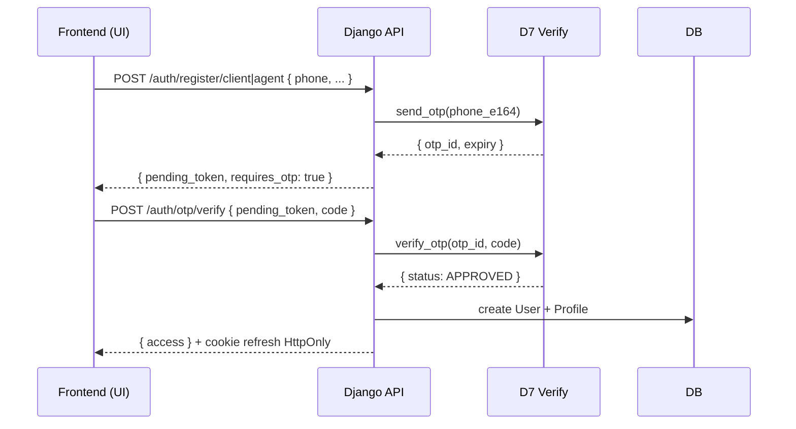
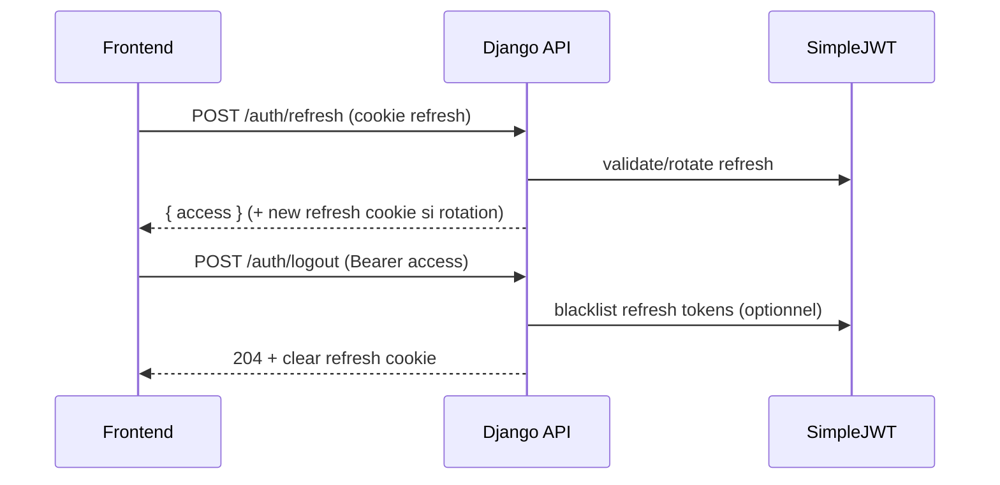

Voici une documentation compacte et réutilisable comme “contexte” pour un LLM (ou une autre équipe) afin de poursuivre le développement frontend ou de réimplémenter les mêmes bonnes pratiques d’auth dans un autre projet Django.

### Diagramme d’architecture (composants)

```mermaid
graph TD
  subgraph Frontend (SPA Vue)
    A[UI / Store Pinia]\naccess en RAM\nwithCredentials=true
  end

  subgraph API Django (DRF)
    B[/Endpoints Auth/]
    H[CSRF/Origin checks]\nX-Requested-With
    C[(DB: Users + Profiles)]
    D[JWT SimpleJWT]\nAccess court\nRefresh long HttpOnly
    E[D7VerifyClient]\n(HTTP, exceptions, logging)
    F[Audit]\nAuthEventLog
    G[Throttling/Lockout]\nScopedRateThrottle + Cache
  end

  subgraph Provider OTP
    P[D7 Verify API]
  end

  A -->|/auth/login\n/auth/refresh\n/auth/logout\n/auth/me| B
  A -->|/auth/register/*\n/auth/otp/*| B
  B --> D
  B --> G
  B --> H
  B --> E -->|send/resend/verify| P
  B --> C
  B --> F
```

### Diagrammes de séquence (flux clés)

Inscription + OTP (stateless)



Refresh + logout



---

## Bilan de ce qui a été implémenté

- **Modèle/normalisation**
  - Numéros en E.164 partout; validation `RegexValidator` sur `User.phone`.
  - Normalisation conservant les zéros locaux (+2250…) (`apps/core/utils/phone.py`).

- **Flux d’auth (stateless OTP D7)**
  - Register client/agent → envoi OTP → `pending_token` signé.
  - Verify OTP → création User + Profile → `access` JSON + cookie refresh HttpOnly.
  - Reset password en 3 étapes (request/verify/finalize) via jetons signés.

- **Sécurité HTTP et sessions**
  - `access` court (en RAM côté front), `refresh` long en cookie HttpOnly, SameSite configurable via env.
  - Rotation des refresh + blacklist activables (SimpleJWT).
  - CORS strict à origines explicites; cookies `Secure` en prod; HSTS configurable.
  - Endpoints cookies (`/auth/refresh`, `/auth/logout`) durcis: Origin/Referer + `X-Requested-With`.
  - CSP prêt: `django-csp` activable par env (Report-Only → enforce).

- **Anti‑abus/OWASP**
  - DRF `ScopedRateThrottle` par scope (login/refresh/logout/otp/reset).
  - Lockout login (5 échecs/15 min) via cache; reset au succès.
  - Anti‑énumération: réponses uniformes register/reset, délais aléatoires (100–300ms), backoff IP léger.

- **D7 Verify (résilience)**
  - Client `D7VerifyClient` avec exceptions `D7VerifyError`, logging sans PII, enveloppé dans les vues (503 contrôlé si indispo).

- **Politique mot de passe**
  - Min 8 + validateur “3 sur 4” (minuscule/majuscule/chiffre/spécial) + validators Django.

- **Observabilité**
  - `AuthEventLog` + `write_auth_event(...)` sur login/refresh/logout, OTP, reset; pas de PII brute (hash téléphone).

**Back‑end: fichiers clés**
- `apps/api/views/auth.py`, `apps/api/serializers/auth.py`, `apps/api/urls.py`
- `apps/users/models.py`
- `apps/core/services/d7_verify.py`, `apps/core/utils/phone.py`, `apps/core/audit.py`, `apps/core/models.py` (AuthEventLog)
- `config/settings.py`: CORS/CSRF, cookies, throttling, SimpleJWT, CSP (env)


### Diagramme d’architecture (composants)

```mermaid
graph TD
  subgraph Frontend (SPA Vue)
    A[UI / Store Pinia]\naccess en RAM\nwithCredentials=true
  end

  subgraph API Django (DRF)
    B[/Endpoints Auth/]
    H[CSRF/Origin checks]\nX-Requested-With
    C[(DB: Users + Profiles)]
    D[JWT SimpleJWT]\nAccess court\nRefresh long HttpOnly
    E[D7VerifyClient]\n(HTTP, exceptions, logging)
    F[Audit]\nAuthEventLog
    G[Throttling/Lockout]\nScopedRateThrottle + Cache
  end

  subgraph Provider OTP
    P[D7 Verify API]
  end

  A -->|/auth/login\n/auth/refresh\n/auth/logout\n/auth/me| B
  A -->|/auth/register/*\n/auth/otp/*| B
  B --> D
  B --> G
  B --> H
  B --> E -->|send/resend/verify| P
  B --> C
  B --> F
```

### Diagrammes de séquence (flux clés)

Inscription + OTP (stateless)


Refresh + logout


---

## Bilan de ce qui a été implémenté

- Modèle/normalisation
  - Numéros en E.164 partout; validation `RegexValidator` sur `User.phone`.
  - Normalisation conservant les zéros locaux (+2250…) (`apps/core/utils/phone.py`).
- Flux d’auth (stateless OTP D7)
  - Register client/agent → envoi OTP → `pending_token` signé.
  - Verify OTP → création User + Profile → `access` JSON + cookie refresh HttpOnly.
  - Reset password en 3 étapes (request/verify/finalize) via jetons signés.
- Sécurité HTTP et sessions
  - `access` court (en RAM côté front), `refresh` long en cookie HttpOnly, SameSite configurable via env.
  - Rotation des refresh + blacklist activables (SimpleJWT).
  - CORS strict à origines explicites; cookies `Secure` en prod; HSTS configurable.
  - Endpoints cookies (`/auth/refresh`, `/auth/logout`) durcis: Origin/Referer + `X-Requested-With`.
  - CSP prêt: `django-csp` activable par env (Report-Only → enforce).
- Anti‑abus/OWASP
  - DRF `ScopedRateThrottle` par scope (login/refresh/logout/otp/reset).
  - Lockout login (5 échecs/15 min) via cache; reset au succès.
  - Anti‑énumération: réponses uniformes register/reset, délais aléatoires (100–300ms), backoff IP léger.
- D7 Verify (résilience)
  - Client `D7VerifyClient` avec exceptions `D7VerifyError`, logging sans PII, enveloppé dans les vues (503 contrôlé si indispo).
- Politique mot de passe
  - Min 8 + validateur “3 sur 4” (minuscule/majuscule/chiffre/spécial) + validators Django.
- Observabilité
  - `AuthEventLog` + `write_auth_event(...)` sur login/refresh/logout, OTP, reset; pas de PII brute (hash téléphone).

Back‑end: fichiers clés
- `apps/api/views/auth.py`, `apps/api/serializers/auth.py`, `apps/api/urls.py`
- `apps/users/models.py`
- `apps/core/services/d7_verify.py`, `apps/core/utils/phone.py`, `apps/core/audit.py`, `apps/core/models.py` (AuthEventLog)
- `config/settings.py`: CORS/CSRF, cookies, throttling, SimpleJWT, CSP (env)

Front‑end: intégration
- `src/services/http.ts`: Axios `withCredentials=true`, `X-Requested-With`, `VITE_API_BASE_URL`.
- `src/Stores/auth.ts`: `pendingToken`, `otpRequest`, `otpVerify`, `refresh`, `fetchMe`.
- Vues: Login, Register (Client/Agent) avec UI OTP, redirection par rôle (`/client`/`/agent`), CTA dans Home.

---

## Contrat d’API (résumé)

- `POST /api/auth/register/client|agent`
  - In: `{ phone, password, username[, email, agency_name] }`
  - Out: `{ requires_otp: true, pending_token }` ou réponse uniforme 200 si anti‑énumération déclenchée.
- `POST /api/auth/otp/verify`
  - In: `{ pending_token, code }`
  - Out: `{ access }` + cookie `refresh_token` HttpOnly.
- `POST /api/auth/login`
  - In: `{ phone, password }` (E.164)
  - Out: `{ access }` + cookie `refresh_token` HttpOnly.
- `POST /api/auth/refresh`
  - In: cookie `refresh_token`, `X-Requested-With: XMLHttpRequest`
  - Out: `{ access }` (+ rotation refresh si activée).
- `POST /api/auth/logout`
  - In: Bearer access + `X-Requested-With: XMLHttpRequest`
  - Out: 204 + clear cookie `refresh_token`.
- `GET /api/auth/me` (Bearer)
  - Out: `{ id, phone, username, email, role }`
- Reset password:
  - `POST /auth/password/reset/request { phone }` → `{ reset_token }`
  - `POST /auth/password/reset/verify { reset_token, code }` → `{ reset_session_token }`
  - `POST /auth/password/reset/finalize { reset_session_token, new_password }`

Codes d’erreur notables
- 401: identifiants invalides / refresh manquant/erroné.
- 403: vérification Origin/X-Requested-With échouée (refresh/logout).
- 429: throttling/lockout.
- 503: D7 indisponible (message neutre).

---

## Variables d’environnement (extraits utiles)

Back‑end (Django)
- `DEBUG`, `SECRET_KEY`, `ALLOWED_HOSTS`
- `CORS_ALLOWED_ORIGINS`, `CSRF_TRUSTED_ORIGINS`
- `AUTH_COOKIE_SAMESITE` (Lax/None), `CSRF_COOKIE_SAMESITE`, `SECURE_SSL_REDIRECT`, `SECURE_HSTS_*`
- `D7_API_BASE_URL`, `D7_API_TOKEN`, `D7_ORIGINATOR`
- `ORANGE_*` (si besoin)
- `ENABLE_CSP`, `CSP_REPORT_ONLY`, `CSP_*` (default/src/img/style/font/connect/frame_ancestors)
- SimpleJWT dans settings (durées, rotation/blacklist)

Front‑end (Vite, par env)
- `.env.development`: `VITE_API_BASE_URL=http://localhost:8000`
- `.env.production`: `VITE_API_BASE_URL=https://api.monajent.com`

---

## Bonnes pratiques adoptées (checklist transposable)

- Session:
  - Access court en mémoire; refresh HttpOnly; rotation + blacklist; pas de storage persistant sensible.
- Réseau/CORS/CSRF:
  - Origines explicites; `X-Requested-With` requis pour endpoints cookies; cookies `Secure` en prod; HSTS; HTTPS only.
- OTP:
  - Zéro écriture DB avant vérification; flux stateless; gestion 503 fournisseur; logs sans PII.
- Téléphone:
  - E.164 unique + validator; normalisation côté serveur.
- Anti‑abus:
  - Throttling scoped, lockout, anti‑énumération (réponses uniformes, jitter, backoff).
- Mots de passe:
  - ≥ 8 + complexité; validators Django activés.
- Observabilité:
  - Audit structuré des évènements; pas de secrets/OTP en logs.
- CSP:
  - Report-Only → enforce; nonce/hash côté front; `connect-src` limité à l’API.
- Front:
  - Intercepteur 401 → refresh unique; ignorer retry si l’erreur vient de `/auth/refresh`.
  - `withCredentials=true` et `X-Requested-With` par défaut.

---

## Portage rapide vers une autre app Django (guide)

1) Modèle/User
- Ajouter validation E.164 (`RegexValidator`) sur `User.phone` et l’utiliser comme `USERNAME_FIELD`.

2) Utils/OTP
- Copier `apps/core/utils/phone.py`.
- Implémenter `D7VerifyClient` avec exception métier et logging discret.

3) Vues DRF
- Reprendre les vues d’auth (`auth.py`) en adaptant:
  - Flux `register` → `pending_token` + OTP D7
  - Flux `otp/verify` → création user + profiles
  - Login/Refresh/Logout/Me
  - Reset password 3 étapes
- Entourer tous les appels D7 de `try/except D7VerifyError` → 503 neutre.

4) Sécurité settings
- CORS/CSRF/SECURE_* via env.
- SimpleJWT (lifetimes + rotation/blacklist).
- Throttling `ScopedRateThrottle` + rates.
- Middleware CSP activable via env.

5) Anti‑énumération & lockout
- Réponses uniformes sur register/reset; jitter/backoff.
- Lockout login cache + purge au succès.

6) Audit
- `AuthEventLog` + `write_auth_event`.

7) Front
- Créer service HTTP Axios:
  - `baseURL` via env; `withCredentials=true`; header `X-Requested-With`.
- Store d’auth:
  - `login`, `refresh`, `logout`, `fetchMe`, `register*` + `otpRequest/otpVerify`.
- UI OTP simple.

8) Tests & prod
- Tests intégration des flux (D7 indispo/timeout; 401→refresh; lockout).
- Activer CSP côté front (reverse proxy) en Report-Only puis enforce.

---

## Extraits utiles (références rapides)

- Intercepteur Axios: ignorer les retries si l’URL est déjà `/api/auth/refresh`.
- Vues `Refresh/Logout`: refuser si Origin/X-Requested-With non conformes (hors DEBUG).
- Normalisation E.164: préservant zéros locaux pour l’OTP provider.
- Throttling DRF: `DEFAULT_THROTTLE_CLASSES=ScopedRateThrottle` + `DEFAULT_THROTTLE_RATES` par scope.

Si tu veux, je peux transformer ce contenu en fichier `AUTH_CONTEXT.md` au format prêt à coller dans un autre repo, ou produire des snippets de config Traefik/CSP pour le front.